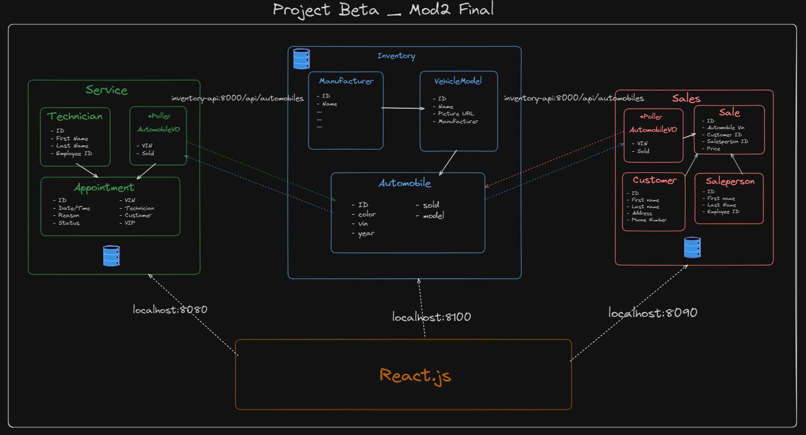

# Dealership Tracker

Team:

* Lillith Long - Sales & Inventory
* Collin Kelly - Service & Inventory

## How to run this App

### Prerequisites

Make sure you have Docker Desktop installed on your device and updated. I suggest you get this up and running first.
Also check to see if you have an IDE like VSCode installed on your desktop.

### SetUp

- Go to https://gitlab.com/collinkelly09/project-beta and Fork the repository
- In your Terminal on your desktop, navigate into your project directory
- In YOUR gitlab, click on the blue CODE drop down and clone your repository
- Back in the terminal where you navigated to your projects directory, use git clone and the repository you just copied
- Navigate into the cloned project and run the following commands in your terminal:
    - docker volume create beta-data
    - docker compose build
    - docker compose up
    - code .
- Get familiar with the code. I prefer to use Insomnia for looking at localhost:8100, localhost:8090 and localhost:8080. When you want to view through the web server,
navigate to localhost:5173 or go into your Docker Desktop app, find the react container, and click on the 5173:5173 button that will be blue.

If you are wanting to add in your own take to the code, I suggest creating a dev branch to push any changes to until you are happy with your code and wanting to merge.

## Diagram

## API Documentation

When you are working in React, follow the pathway mentioned above (localhost:5173) to view adjustments and such for the front-end. I usually restart my containers every
change I make to the code in order to see it in the browser. If you are on Mac, this might not be the case as Docker should refresh automatically. We did adjust the vite.config
in order for your browser to automatically refresh whenever a change is saved.

### URLs and Ports

**Manufacturer**:
| METHOD | URL | WHAT IT DOES |
| -------- | -------- | -------- |
| GET | http://localhost:8100/api/manufacturers/ | List manufacturers |
| GET | http://localhost:8100/api/manufacturers/:id/ | Get a specific manufacturer |
| POST | http://localhost:8100/api/manufacturers/ | Create a manufacturer |
| PUT | http://localhost:8100/api/manufacturers/:id/ | Update a specific manufacturer |
| DELETE | http://localhost:8100/api/manufacturers/:id/ | Delete a specific manufacturer |

**VEHICLE MODELS**:
| METHOD | URL | WHAT IT DOES |
| -------- | -------- | -------- |
| GET | http://localhost:8100/api/models/ | List vehicle models |
| GET | http://localhost:8100/api/models/:id/ | Get a specific vehicle model |
| POST | http://localhost:8100/api/models/ | Create a vehicle model |
| PUT | http://localhost:8100/api/models/:id/ | Update a specific vehicle model |
| DELETE | http://localhost:8100/api/models/:id/ | Delete a specific vehicle model |

**AUTOMOBILES**:
| METHOD | URL | WHAT IT DOES |
| -------- | -------- | -------- |
| GET | http://localhost:8100/api/automobiles/ | List automobiles |
| GET | http://localhost:8100/api/automobiles/:vin/ | Get a specific automobile |
| POST | http://localhost:8100/api/automobiles/ | Create an automobile |
| PUT | http://localhost:8100/api/automobiles/:vin/ | Update a specific automobile |
| DELETE | http://localhost:8100/api/automobiles/:vin/ | Delete a specific automobile |

**TECHNICIANS**:
| METHOD | URL | WHAT IT DOES |
| -------- | -------- | -------- |
| GET | http://localhost:8080/api/technicians/ | List technicians |
| POST | http://localhost:8080/api/technicians/ | Create a technician |
| DELETE | http://localhost:8080/api/technicians/:id/ | Delete a specific technician |

**APPOINTMENTS**:
| METHOD | URL | WHAT IT DOES |
| -------- | -------- | -------- |
| GET | http://localhost:8080/api/appointments/ | List appointments |
| POST | http://localhost:8080/api/appointments/ | Create an appointment |
| DELETE | http://localhost:8080/api/appointments/:id/ | Delete an appointment |
| PUT | http://localhost:8080/api/appointments/:id/cancel/ | Set appointment status to "canceled" |
| PUT | http://localhost:8080/api/appointments/:id/finish/ | Set appointment status to "finished" |

**SALESPEOPLE**:
| METHOD | URL | WHAT IT DOES |
| -------- | -------- | -------- |
| GET | http://localhost:8090/api/salespeople/ | List salespeople |
| GET | http://localhost:8090/api/salespeople/:id/ | Get a specific salesperson |
| POST | http://localhost:8090/api/salespeople/ | Create a salesperson |
| PUT | http://localhost:8090/api/salespeople/:id/ | Update a specific salesperson |
| DELETE | http://localhost:8090/api/salespeople/:id/ | Delete a specific salesperson |

**CUSTOMERS**:
| METHOD | URL | WHAT IT DOES |
| -------- | -------- | -------- |
| GET | http://localhost:8090/api/customers/ | List customers |
| GET | http://localhost:8090/api/customers/:id/ | Get a specific customer |
| POST | http://localhost:8090/api/customers/ | Create an customer |
| PUT | http://localhost:8090/api/customers/:id/ | Update a specific customer |
| DELETE | http://localhost:8090/api/customers/:id/ | Delete a specific customer |

**SALES**:
| METHOD | URL | WHAT IT DOES |
| -------- | -------- | -------- |
| GET | http://localhost:8090/api/sales/ | List sales |
| GET | http://localhost:8090/api/sales/:id | Get a specific sale |
| POST | http://localhost:8090/api/sales/ | Create an sale |
| PUT | http://localhost:8090/api/sales/:id | Update a specific sale |
| DELETE | http://localhost:8090/api/sales/:id | Delete a specific sale |

### Inventory microservice

This API is the starting microservice for the CarCar Application, creating a starting database for
the other microservices to connect to.
- The Django backend handles API requests. Key components:
    - views.py
        - api_automobiles
        - api_automobile
        - api_manufacturers
        - api_manufacturer
        - api_vehicle_models
        - api_vehicle_model
    - models.py
        - Manufacturer
        - VehicleModel
        - Automobile
    - encoders.py
        - ManufacturerEncoder
        - VehicleModelEncoder
        - AutomobileEncoder

- The React frontend consumes the API to display and manage automobiles in the user's inventory. Key components:
    - App.jsx
        - App
    - CreateM.jsx
        - ManufacturerCreationForm
    - Manufacturers.jsx
        - ManufacturerTable
        - ManufacturersList
    - CreateModel.jsx
        - ModelCreationForm
    - Models.jsx
        - ModelsList
        - ModelsTable
    - AutomobileList.jsx
        - CreateTable
        - AutomobileList
    - AutomobileForm.jsx
        - AutoForm

When you are wanting to adjust the database for automobiles in Insomnia using JSON instead of the form:
- POST: localhost:8100/api/manufacturers/  
        `{`  
        `"name": "INPUT"`  
        `}`
- PUT: localhost:8100/api/manufacturers/:id/  
        `{`  
        `"name": "INPUT"`  
        `}`
- POST: localhost:8100/api/models/  
        `{`  
        `"name": "INPUT",`  
        `"picture_url": "INPUT",`  
        `"manufacturer_id": ID NUMBER`  
        `}`
- PUT: localhost:8100/api/models/:id/  
        `{`  
        `"name": "INPUT",`  
        `"picture_url": "INPUT"`  
        `}`
- POST: localhost:8100/api/automobiles/  
        `{`  
        `"color": "INPUT",`  
        `"year": NUMBER,`  
        `"vin": "VIN INPUT",`  
        `"model_id": ID NUMBER`  
        `}`
- PUT: localhost:8100/api/automobiles/:vin/  
        `{`  
        `"color": "INPUT",`  
        `"year": NUMBER,`  
        `"sold": true`  
        `}`

You can get the list or delete anything by following the paths posted above. PLEASE make sure the picture URL ends in a .png or .jpeg.

### Service microservice

This API connects the Service microservice to the Inventory microservice, allowing seamless integration of Service data into the Inventory system.
- The Django backend handles API requests and communicates between the Service and Inventory microservices. Key components:
    - views.py
        - api_list_technicians
        - api_show_tech
        - api_list_appointments
        - api_show_appointments
        - api_cancel_appointment
        - api_finish_appointment
    - models.py
        - Technician
        - Appointment
        - AutomobileVO
    - encoders.py
        - TechnicianEncoder
        - AppointmentEncoder
        - AutomobileVOEncoder

- The React frontend consumes the API to display and manage service components in the user's application. Key components:
    - App.jsx
        - App
    - TechForm.jsx
        - TechForm
    - TechnicianList.jsx
        - CreateTable
        - TechnicianList
    - AppointmentList.jsx
        - AppointmentList
    - AppointmentHistory.jsx
        - AppointmentHistory
        - CreateTable
    - AppointmentForm.jsx
        - ApptForm

When you are wanting to adjust the database for service in Insomnia using JSON instead of the form:
- POST: localhost:8080/api/technicians/  
        `{`  
        `"first_name": "STRING",`  
        `"last_name": "STRING",`  
        `"employee_id": "STRING"`  
        `}`
- POST:localhost:8080/api/appointments/   
      `{`  
      `"date_time": "yyyy-mm-ddThh:mm:ss+00:00",`  
      `"reason": "STRING",`  
      `"vin": "STRING",`  
      `"technician": NUMBER,`  
      `"customer": "STRING"`  
      `}`
- PUT: localhost:8080/api/technicians/<int:id>/cancel
  - (No JSON Required)
- PUT: localhost:8080/api/technicians/<int:id>/finish
  - (No JSON Required)

You can get the list or delete anything by following the paths posted above.

### Sales microservice

This API connects the Sales microservice to the Inventory microservice, allowing seamless integration of sales data into the inventory system.
- The Django backend handles API requests and communicates between the Sales and Inventory microservices. Key components:
    - views.py
        - list_salespeople
        - update_salespeople
        - list_customers
        - update_customers
        - list_sales
        - update_sales
    - models.py
        - AutomobileVO
        - Salesperson
        - Customer
        - Sale
    - encoders.py
        - AutomobileVODetailEncoder
        - SalespeopleEncoder
        - CustomersEncoder
        - SalesEncoder

- The React frontend consumes the API to display and manage sales components in the user's application. Key components:
    - App.jsx
        - App
    - CreateC.jsx
        - CustomerCreationForm
    - Customers.jsx
        - CustomersTable
        - CustomersList
    - CreateSP.jsx
        - SalespersonCreationForm
    - Salespeople.jsx
        - SalespeopleTable
        - SalespeopleList
    - SPHistory.jsx
        - SalesTable
        - SalesByIDList
    - NewSale.jsx
        - NewSaleForm
    - Sales.jsx
        - SalesTable
        - SalesList

When you are wanting to adjust the database for sales, salespeople, or customers in Insomnia using JSON instead of the form:
- POST: localhost:8090/api/sales/  
        `{`  
        `"price": NUMBER,`  
        `"automobile": "VIN",`  
        `"salesperson": "EMPLOYEE_ID",`  
        `"customer": ID NUMBER`  
        `}`
- PUT: localhost:8090/api/sales/<int:id>/  
        `{`  
        `"price": "INPUT"`  
        `}`
- POST: localhost:8090/api/salespeople/  
        `{`  
        `"first_name": "INPUT",`  
        `"last_name": "INPUT",`  
        `"employee_id": "INPUT"`  
        `}`
- PUT: localhost:8090/api/salespeople/<int:id>/  
        `{`  
        `"first_name": "INPUT",`  
        `"last_name": "INPUT",`  
        `"employee_id": "INPUT"`  
        `}`
- POST: localhost:8090/api/customers/  
        `{`  
        `"first_name": "INPUT",`  
        `"last_name": "INPUT",`  
        `"address": "INPUT",`  
        `"phone_number": "INPUT"`  
        `}`  
- PUT: localhost:8090/api/customers/<int:id>/  
        `{`  
        `"first_name": "INPUT",`  
        `"last_name": "INPUT",`  
        `"address": "INPUT",`  
        `"phone_number": "INPUT"`  
        `}`  

You can get the list or delete anything by following the paths posted above.

### Value Objects

- AutomobileVO
